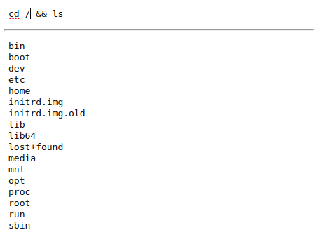

# The Grid

> Beta

This package allows SSH server connection and tasks execution.

## Installation

```shell
composer install
```

## Usage

**Step 1**

Create your own `.env` and update it:

```shell
cp .env.sample .env
```

**Step 2**

Start:

```shell
php the-grid start -v $(pwd)/.env
```

**Step 3**

Access your brownser on http://localhost:8004 (or the port you set, by running `php the-grid start --help` you'll see the available options).

## Sample Template

After adding the command at the top and typing "Ctrl+Enter", the command gets executed on your configured server via ssh and shows the results as follows:



## Tests

```shell
vendor/bin/phpunit
```